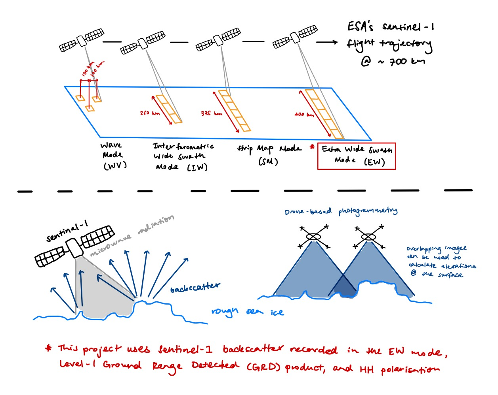
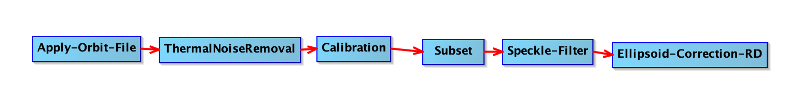
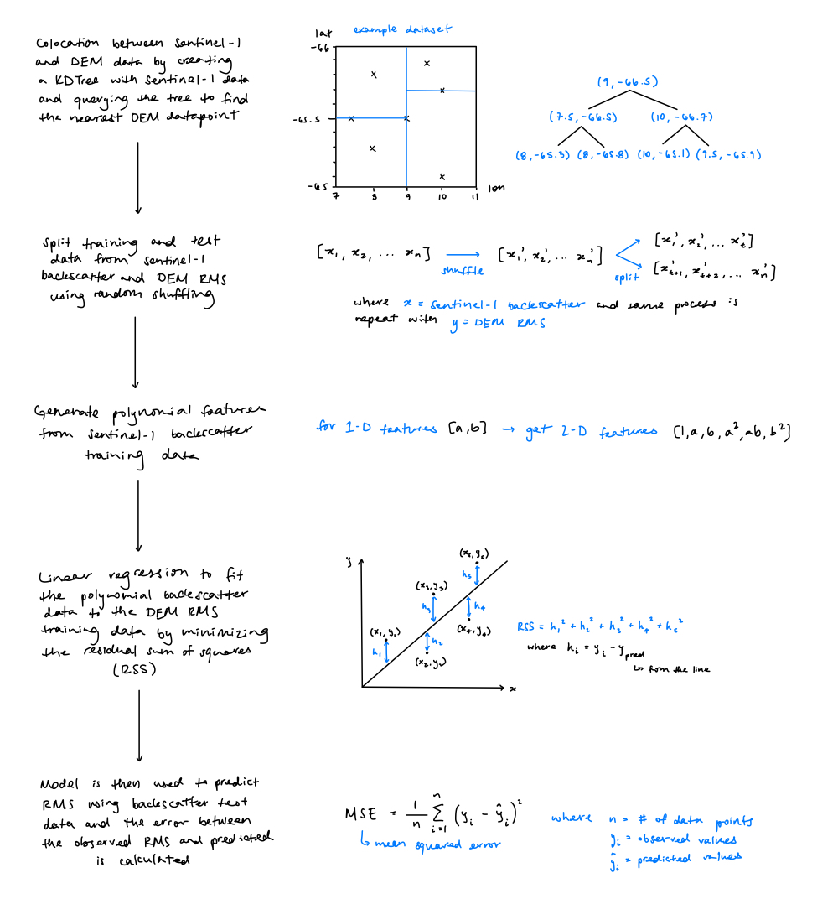

# GEOL0069_Project

  <!-- DESCRIPTION -->
## Project Description

The goal for this project is to use artificial intelligence to train a model for sea ice roughness using RMS calculations taken over DEMs from drone-based photogrammetry data and HH backscatter from the European Space Agency's Sentinel-1 satellite. The _project.ipynb_ notebook linked to this Github builds on the methods taught in the GEOL0069 Artificial Intelligence for Earth Observation module at University College London (UCL).

Surface roughness is defined as deviations in height along a surface at a particular reference level; the roughness of natural surfaces is determined by the different scales of roughness that are superimposed (Cafarella et al., 2019). Sea ice roughness is a parameter that is used in scientific studies on the atmosphere and the ocean due to its relation to momentum, to help predict summer melt ponds and the annual minimum extent of sea ice, as well as more practical applications such as for sea ice travel for indigenous communities and the navigability of the Arctic Ocean by cargo ships (johnson et al., 2022).

Sentinel-1 is a radar imaging mission that was launched by the European Space Agency in 2014, which is polar-orbiting and made up of two satellites, Sentinel-1A and B (ESA, n.d.-a). It is an active sensor that uses a C-band synthetic aperture radar, and its central frequency of 5.405 GHz allows it to collect images of the surface of the Earth at all times, regardless of changes in weather or light conditions (Filipponi, 2019). Sentinel-1 has different product types, acquisition modes and polarisations which can be used for different applications; the settings used for the Sentinel-1 swaths included in this project are ground range detected (GRD) products, extra-wide swath (EW) and single HH polarisation as they are ideal for sea-ice monitoring (ESA, n.d.-a).

Sentinel-1 HH backscatter has been shown in the past to be related to sea ice roughness in studies such the one conducted by Segal et al. (2020).

In this project, root mean square (RMS) calculations over photogrammetry-derived digital elevation models (DEMs) are colocated with HH brightness datapoints in order to produce a regression model between the two and predict sea ice roughness based on HH backscatter. The data used to produce these DEMs comes from a locality called Pond Inlet in the Canadian Arctic.

The regression model trained using data over Pond Inlet is also applied here to the localities of Cambridge Bay and Arctic Bay.

See the diagram below for...



  <!-- GETTING STARTED -->
## Prerequisites

The following software needs to be installed to run the code.
* Mounting Google Drive on Google Colab
  ```sh
  from google.colab import drive
  drive.mount('/content/drive')
  ```
* Using pip install:
  ```sh
  !pip install GDAL
  ```
  ```sh
  !pip install numpy
  ```
  ```sh
  !pip install rasterio
  ```
  ```sh
  !pip install GPy
  ```

  <!-- DATA -->
## Fetching Data

Define functions to get access tokens and download products by name from the Copernicus Data Space Ecosystem.

```sh
cop_dspace_usrnm = '' # amend with your copernicus dataspace username
cop_dspace_psswrd = ''# amend with your copernicus dataspace password
token, refresh_token = get_access_token(cop_dspace_usrnm, cop_dspace_psswrd)
product_names = [
    "S1A_EW_GRDM_1SDH_20230419T121123_20230419T121223_048165_05CA73_A681.SAFE",
    "S1A_EW_GRDM_1SDH_20230419T135049_20230419T135145_048166_05CA7C_5C05.SAFE"
]
```

### Pre-processing

The pre-processing of the Sentinel-1 data was carried out using the Sentinel Application Platform or SNAP by the European Space Agency. The steps included applying orbit files, thermal noise removal, calibration, a speckle-filter and ellipsoid correction. A subset was also defined over the area of interest.



### Converting .tif files to .npy data

A function is defined using GDAL to open the file, read the raster data as an array, calculate the X and Y coordinates for the associated pixel values, and export and save the X, Y and Z arrays, which in other words are the longitude, latitude and Sentinel-1 brightness values.

DEM files:
```sh
2023-04-18_s7grid300_dsm_wav_dem_a10_z10_clip.tif
2023-04-19_s1grid300_dsm_wav_dem_a10_z10_clip.tif
2023-04-20_s3grid300_dsm_wav_dem_a10_z10_clip.tif
2023-04-21_s2grid300_dsm_wav_dem_a10_z10_clip.tif
2023-04-22_s5grid300_dsm_wav_dem_a10_z10_clip.tif
2023-04-22_s6grid300_dsm_wav_dem_a10_z10_clip.tif
```

  <!-- DEM -->
## Calculating RMS from the photogrammetry DEMs

Using a grid-size of 20 metres in order to have a few points per Sentinel-1 40x40m pixel

### Colocating Sentinel-1 and DEM data

Using KD-trees...

  <!-- REGRESSION -->
## Testing different regression types

* Polynomial Regression:
* Neural Network Regression:
* Gaussian Process Regression with GPy:
* Gaussian Process Regression with GPSat:



  <!-- MODEL ROLLOUT -->
## Using the polynomial model over sea ice
### Pond Inlet

...

### Cambridge Bay

...

### Other?

...

  <!-- SENSITIVITY -->
## Sensitivity of predictions across the DEMs


<!-- REFERENCES -->
## References

Cafarella, S., Scharien, R. K., Geldsetzer, T., Howell, S. B., Haas, C., Segal, R., & Nasonova, S. (2019). Estimation of Level and Deformed First-Year Sea Ice Surface Roughness in the Canadian Arctic Archipelago from C- and L-Band Synthetic Aperture Radar. Canadian Journal of Remote Sensing, 45(3-4), 457–475. https://doi.org/10.1080/07038992.2019.1647102

European Space Agency (ESA). (n.d.-a). The Sentinel Missions. Www.esa.int.
https://www.esa.int/Applications/Observing_the_Earth/Copernicus/The_Sentinel_missions#:~:text=Sentinel%2D1%20is
%20a%20polar

European Space Agency (ESA). (n.d.-b). User Guides - Sentinel-1 SAR - Sentinel Online - Sentinel Online. Sentinels.copernicus.eu.
https://sentinels.copernicus.eu/web/sentinel/user-guides/sentinel-1-sar

Filipponi, F. (2019). Sentinel-1 GRD Preprocessing Workflow. Proceedings, 18(1), 11. https://doi.org/10.3390/ecrs-3-06201

Johnson, T., Tsamados, M., Muller, J.-P., & Stroeve, J. (2022). Mapping Arctic Sea-Ice Surface Roughness with Multi-Angle
Imaging SpectroRadiometer. Remote Sensing, 14(24), 6249–6249. https://doi.org/10.3390/rs14246249

