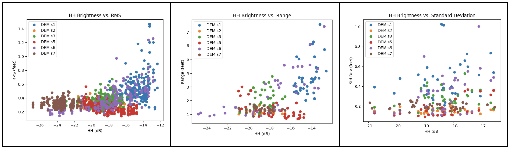

# GEOL0069_Project

  <!-- DESCRIPTION -->
## Project Description

The goal for this project is to use artificial intelligence to train a model for sea ice roughness using RMS calculations taken over DEMs from drone-based photogrammetry data and HH backscatter from the European Space Agency's Sentinel-1 satellite. The _project.ipynb_ notebook linked to this Github builds on the methods taught in the GEOL0069 Artificial Intelligence for Earth Observation module at University College London (UCL).

Surface roughness is defined as deviations in height along a surface at a particular reference level; the roughness of natural surfaces is determined by the different scales of roughness that are superimposed (Cafarella et al., 2019). Sea ice roughness is a parameter that is used in scientific studies on the atmosphere and the ocean due to its relation to momentum, to help predict summer melt ponds and the annual minimum extent of sea ice, as well as more practical applications such as for sea ice travel for indigenous communities and the navigability of the Arctic Ocean by cargo ships (johnson et al., 2022).

Sentinel-1 is a radar imaging mission that was launched by the European Space Agency in 2014, which is polar-orbiting and made up of two satellites, Sentinel-1A and B (ESA, n.d.-a). It is an active sensor that uses a C-band synthetic aperture radar, and its central frequency of 5.405 GHz allows it to collect images of the surface of the Earth at all times, regardless of changes in weather or light conditions (Filipponi, 2019). Sentinel-1 has different product types, acquisition modes and polarisations which can be used for different applications; the settings used for the Sentinel-1 swaths included in this project are ground range detected (GRD) products, extra-wide swath (EW) and single HH polarisation as they are ideal for sea-ice monitoring (ESA, n.d.-a).

Sentinel-1 backscatter has been shown in the past to be related to sea ice roughness in studies such the one conducted by Segal et al. (2020) and Chen et al. (2024). The single polarisation HH channel was selected on its own over using it in combination with the HV channel due to the noisy artefacts that are visible in sub-swaths of the EW mode.

The photogrammetry data used to produce the digital elevation models (DEMs) utilised here were taken between the 18th-22nd of April 2023 over Pond Inlet, in the Canadian Arctic, during a field campaign for _Sikuttiaq_, a project to improve sea ice travel safety maps in the area by the Canada-Inuit Nunangat-United Kingdom Arctic Programme’s (Newman et al., 2018; CINUK, n.d.).

In this project, root mean square (RMS) calculations over photogrammetry-derived DEMs are colocated with HH brightness datapoints in order to produce a regression model between the two and predict sea ice roughness based on HH backscatter. The regression model trained using data over Pond Inlet is also applied here to the localities of Cambridge Bay and Arctic Bay.

See the diagram below which illustrates the remote sensing techniques used here:


  <!-- GETTING STARTED -->
## Prerequisites

The following software needs to be installed to run the code.
* Mounting Google Drive on Google Colab
  ```sh
  from google.colab import drive
  drive.mount('/content/drive')
  ```
* Using pip install:
  ```sh
  !pip install GDAL
  ```
  ```sh
  !pip install numpy
  ```
  ```sh
  !pip install rasterio
  ```
  ```sh
  !pip install GPy
  ```

  <!-- DATA -->
## Fetching Data

Define functions to get access tokens and download products by name from the Copernicus Data Space Ecosystem.

```sh
cop_dspace_usrnm = '' # amend with your copernicus dataspace username
cop_dspace_psswrd = ''# amend with your copernicus dataspace password
token, refresh_token = get_access_token(cop_dspace_usrnm, cop_dspace_psswrd)
product_names = [
    "S1A_EW_GRDM_1SDH_20230419T121123_20230419T121223_048165_05CA73_A681.SAFE",
    "S1A_EW_GRDM_1SDH_20230419T135049_20230419T135145_048166_05CA7C_5C05.SAFE"
]
```

### Pre-processing

The pre-processing of the Sentinel-1 data was carried out using the Sentinel Application Platform or SNAP by the European Space Agency. The steps included applying orbit files, thermal noise removal, calibration, a speckle-filter and ellipsoid correction. A subset was also defined over the area of interest.

_For more information on the individual pre-processing steps please visit the [Sentinel Toolbox Overview for SNAP](https://step.esa.int/main/doc/online-help/)._


### Converting .tif files to .npy data

A function is defined using GDAL to open the file, read the raster data as an array, calculate the X and Y coordinates for the associated pixel values, and export and save the X, Y and Z arrays, which in other words are the longitude, latitude and Sentinel-1 brightness values.

DEM files:
```sh
2023-04-18_s7grid300_dsm_wav_dem_a10_z10_clip.tif
2023-04-19_s1grid300_dsm_wav_dem_a10_z10_clip.tif
2023-04-20_s3grid300_dsm_wav_dem_a10_z10_clip.tif
2023-04-21_s2grid300_dsm_wav_dem_a10_z10_clip.tif
2023-04-22_s5grid300_dsm_wav_dem_a10_z10_clip.tif
2023-04-22_s6grid300_dsm_wav_dem_a10_z10_clip.tif
```

  <!-- DEM -->
## Colocate data and testing different roughness metrics

Three different roughness metrics were calculated and compared to select the one with the strongest relationship with the HH brightness and that most accurately captured the sea ice roughness. These metrics were range, standard deviation and RMS, which was ultimately selected for the regression models; they were initially calculated using a grid-size of 40 metres pixels to match the Sentinel-1 40x40m swath pixel size. The RMS was also calculated over a grid-size of 20 metres in order to have a higher number of datapoints to use for the regression.

For example, here were the steps to calculate RMS over a 20m grid-size:
```sh
## Calculate RMS by binning longitude and latitude into grid cells and save as .npy format

# Define the size of the grid cells
grid_size = 20  # metres

# Define bins for lon/lat
lon_bins = np.arange(min(lon_DEM_flat), max(lon_DEM_flat) + grid_size, grid_size)
lat_bins = np.arange(min(lat_DEM_flat), max(lat_DEM_flat) + grid_size, grid_size)

# Arrays to store RMS values and centre coordinates of bins
rms_values = np.zeros((len(lat_bins) - 1, len(lon_bins) - 1))
lon_centers = np.zeros((len(lat_bins) - 1, len(lon_bins) - 1))
lat_centers = np.zeros((len(lat_bins) - 1, len(lon_bins) - 1))

# Calculate RMS for each grid cell
for i in range(len(lon_bins) - 1):
    for j in range(len(lat_bins) - 1):
        # Indices of points within each bin
        indices = np.where((lon_DEM_flat >= lon_bins[i]) & (lon_DEM_flat < lon_bins[i+1]) &
                           (lat_DEM_flat >= lat_bins[j]) & (lat_DEM_flat < lat_bins[j+1]))
        elevations = elevation_flat[indices]
        if elevations.size > 0:
            rms_values[j, i] = np.sqrt(np.mean(np.square(elevations)))
        # Calculate centre coordinates of each bin
        lon_centers[j, i] = (lon_bins[i] + lon_bins[i + 1]) / 2
        lat_centers[j, i] = (lat_bins[j] + lat_bins[j + 1]) / 2
```

### Colocating Sentinel-1 and DEM data

KD-trees were used in this project to colocate the Sentinel-1 HH brightness and DEM datapoints. First, a KD-tree was created using the Sentinel-1 data, and then the tree was queried to find the nearest point in the Sentinel-1 data for each point in the DEM datasets for each roughness metric used.

These functions are available through scipy:
```sh
from scipy.spatial import cKDTree
```

### Scatter plots of HH brightness vs. different roughness metrics


  <!-- REGRESSION -->
## Testing different regression types

* Polynomial Regression: using PolynomialFeatures and LinearRegression from sklearn
```sh
from sklearn.preprocessing import PolynomialFeatures
from sklearn.linear_model import LinearRegression

polynomial_features = PolynomialFeatures(degree=2)
X_poly_train = polynomial_features.fit_transform(X_train)

model_poly = LinearRegression()
model_poly.fit(X_poly_train, y_train)

X_poly_test = polynomial_features.transform(X_test)
```

The Mean Squared Error (MSE) on the test set is: 0.1048.


* Neural Network Regression: using Sequential and Dense from tensorflow
```sh
import tensorflow as tf
from tensorflow.keras.models import Sequential
from tensorflow.keras.layers import Dense

model_nn = Sequential([
    Dense(256, activation='relu', input_shape=(1,)),
    Dense(1)
])

model_nn.compile(optimizer='adam', loss='mean_squared_error')

model_nn.fit(X_train, y_train, epochs=20)
```

The Mean Squared Error (MSE) on the test set is: 0.1293.


* Gaussian Process Regression with GPy: using SparseGPRegression from GPy
```sh
import GPy

kernel = GPy.kern.RBF(input_dim=1)
num_inducing = 100

gp = GPy.models.SparseGPRegression(X_train, y_train.reshape(-1, 1), kernel, num_inducing=num_inducing)

gp.optimize(messages=True)
```

The Mean Squared Error (MSE) on the test set is: 0.1293.


* Gaussian Process Regression with GPSat: using sklearnGPRModel from GPSat (a repository needs to be prepared in order to use GPSat and pip install needs to be used to install the requirements and GPSat itself to Google Colab)
```sh
from GPSat.models.sklearn_models import sklearnGPRModel

gpr = sklearnGPRModel(coords=X_test, obs=y_test, kernel='RBF', verbose=False)
```


See the diagram below which illustrates the AI algorithm/methods used and their implementation:


  <!-- MODEL ROLLOUT -->
## Using the polynomial model over sea ice
### Pond Inlet

...

### Cambridge Bay

...

### Arctic Bay

...

  <!-- SENSITIVITY -->
## Sensitivity Analysis


<!-- REFERENCES -->
## References

Cafarella, S., Scharien, R. K., Geldsetzer, T., Howell, S. B., Haas, C., Segal, R., & Nasonova, S. (2019). Estimation of Level and Deformed First-Year Sea Ice Surface Roughness in the Canadian Arctic Archipelago from C- and L-Band Synthetic Aperture Radar. Canadian Journal of Remote Sensing, 45(3-4), 457–475. https://doi.org/10.1080/07038992.2019.1647102

Canada-Inuit Nunangat-United Kingdom Arctic Research Programme (CINUK). (n.d.). Sikuttiaq - Sea ice travel safety, Inuit Qaujimajatuqangit, sea ice monitoring. CINUK. https://www.cinuk.org/projects/sikuttiaq/

Chen, P., Chen, Z., Sun, R., & He, Y. (2024). An ensemble learning method to retrieve sea ice roughness from Sentinel-1 SAR images. Acta Oceanologica Sinica, 43, 1-13. 

European Space Agency (ESA). (n.d.-a). The Sentinel Missions. Www.esa.int.
https://www.esa.int/Applications/Observing_the_Earth/Copernicus/The_Sentinel_missions#:~:text=Sentinel%2D1%20is
%20a%20polar

European Space Agency (ESA). (n.d.-b). User Guides - Sentinel-1 SAR - Sentinel Online - Sentinel Online. Sentinels.copernicus.eu.
https://sentinels.copernicus.eu/web/sentinel/user-guides/sentinel-1-sar

Filipponi, F. (2019). Sentinel-1 GRD Preprocessing Workflow. Proceedings, 18(1), 11. https://doi.org/10.3390/ecrs-3-06201

Johnson, T., Tsamados, M., Muller, J.-P., & Stroeve, J. (2022). Mapping Arctic Sea-Ice Surface Roughness with Multi-Angle
Imaging SpectroRadiometer. Remote Sensing, 14(24), 6249–6249. https://doi.org/10.3390/rs14246249

Newman, T., Arreak, A., Tsamados, M., Briggs, R., Thibault, C., & Blanco-Cabanillas , A. (2024). A (low cost) drone
photogrammetry workflow for sea ice roughness extraction. Sikuttiaq Presentation.

